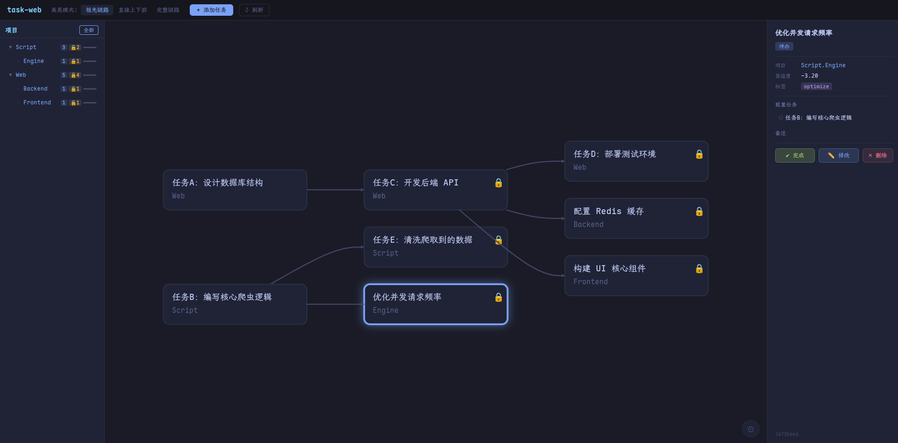

# task-web

基于 Taskwarrior 的网页端任务可视化工具。

以 DAG（有向无环图）的形式展示任务依赖关系，项目层级作为过滤维度，支持高亮任务链路、查看任务详情和快速操作。

## TODO

- [ ] 月度记录 Monthly Log
- [ ] 日历视图
- [ ] 任务消耗时间

## 界面结构



## 功能特性

- **DAG 可视化**：任务依赖关系以有向图展示，从左到右布局
- **锁定状态**：前置任务未完成时显示 🔒，节点颜色变暗
- **高亮模式**（可切换）：
  - 祖先链路（默认）：高亮从根到当前节点的完整链路
  - 直接上下游：只高亮直接前置和后续任务
  - 完整链路：高亮选中节点所在的整条链路（含后续）
- **项目树**：左侧显示项目层级，点击过滤 DAG 图
- **任务详情**：右侧显示完整元数据，支持完成/修改/删除
- **平移缩放**：鼠标拖拽平移，滚轮缩放，⊙ 按钮重置视图
- **Tokyo Night** 主题

## 环境要求

- Python 3.11+
- Node.js 18+（推荐用 pnpm）
- Taskwarrior 3.x

## 安装与启动

### 后端

#### Python 实现

```bash
cd backend

# 使用 uv（推荐）

uv sync
uv run uvicorn main:app --reload --port 8765

# 或使用 pip
pip install fastapi "uvicorn[standard]"
uvicorn main:app --reload --port 8765
```

#### Rust 实现

```bash

```

### 前端

```bash
cd frontend
pnpm install   # 或 npm install
pnpm dev       # 启动开发服务器，访问 http://localhost:5173
```

两个服务都启动后，打开 http://localhost:5173 即可使用。

## 添加任务语法

在顶部输入框支持 Taskwarrior 原生语法：

```
修复登录 bug project:work.backend due:2026-05-20 priority:H
设计新 UI depends:3,5 +frontend
```

修改任务同理，在右侧详情面板点击"修改"后输入修改参数。

## 项目结构

```
task-web/
├── backend/
│   ├── pyproject.toml   # Python 依赖
│   ├── main.py          # FastAPI 服务入口
│   ├── api.py           # API 路由定义
│   └── data.py          # task export 调用和数据处理
└── frontend/
    ├── package.json
    ├── vite.config.js
    └── src/
        ├── main.js
        ├── App.vue                      # 根组件，全局状态管理
        ├── style.css                    # Tokyo Night 全局样式
        ├── components/
        │   ├── ProjectTree.vue          # 左侧项目树面板
        │   ├── ProjectTreeNode.vue      # 项目树递归节点
        │   ├── TaskGraph.vue            # 中间 D3 DAG 图
        │   └── TaskDetail.vue           # 右侧任务详情面板
        └── composables/
            ├── useApi.js                # API 客户端封装
            └── useLayout.js             # dagre 布局和高亮计算
```
